# Homelab Infrastructure

## Overview

This documentation presents the architecture of a personal homelab with containerized services, redundant network infrastructure, and gaming services.

## 1. Global Network Architecture

## 2. Services per Machine

## 3. Data Flow and Communications

```mermaid
graph LR
    subgraph External["🌍 External"]
        Internet([Internet])
        Remote[Remote<br/>Users]
    end
    
    subgraph Network["🏠 Local Network"]
        Clients[Network Clients]
        
        subgraph DHCP_HA["⚡ DHCP High Availability"]
            DHCP_M[DHCP Master<br/>ARM Server]
            DHCP_B[DHCP Backup<br/>x86 Server]
            DHCP_M -.sync.-> DHCP_B
        end
        
        subgraph DNS_HA["🔍 DNS High Availability"]
            DNS_M[DNS Master<br/>ARM Server]
            DNS_B[DNS Backup<br/>x86 Server]
            DNS_M -.sync.-> DNS_B
        end
        
        subgraph MC_Stack["🎮 Gaming Stack"]
            Proxy[Game Proxy]
            Game[Game Server<br/>+ Voice Chat]
            Discord[Discord Bot]
            Backup[Backup Service]
            Restore[Restore Service]
            Storage[(Storage)]
            
            Proxy --> Game
            Game --> Discord
            Game --> Backup
            Backup --> Storage
            Restore --> Storage
            Restore --> Game
        end
        
        RevProxy[Reverse Proxy]
        App1[Web Application]
        App2[Map Visualization]
        Files[File Server]
        
        FileShare[Network Share]
        VPN[VPN]
    end
    
    Internet --> VPN
    Remote --> VPN
    VPN --> Network
    
    Clients --> DHCP_M
    Clients --> DNS_M
    Clients --> RevProxy
    
    Internet --> RevProxy
    
    RevProxy --> App1
    RevProxy --> App2
    RevProxy --> Files
    
    Files -.auth.-> Storage
    
    Clients --> MC_Stack
    Clients --> FileShare
    
    style External fill:#90EE90
    style DHCP_HA fill:#ffe1e1
    style DNS_HA fill:#e1f0ff
    style MC_Stack fill:#f5e1ff
```

## 4. Service Details

### Network Infrastructure

| Service | Machine | Role | Type |
|---------|---------|------|------|
| **DHCP** | ARM Server (Master) | IP Assignment - Primary | Container |
| **DHCP** | x86 Server (Backup) | IP Assignment - Secondary | Container |
| **DNS** | ARM Server (Master) | Resolution + Filtering - Primary | Container |
| **DNS** | x86 Server (Backup) | Resolution + Filtering - Secondary | Container |

### Web Services and Proxy

| Service | Machine | Description | Access |
|---------|---------|-------------|--------|
| **Reverse Proxy** | x86 Server | HTTPS Proxy | Local + External |
| **Penny Game** | x86 Server | Custom web application | Via Proxy |
| **Pl3xmap** | x86 Server | Interactive game map | Via Proxy |
| **File Server** | x86 Server | Accessible files | Via Proxy (auth) |

### Gaming and Communication

| Service | Machine | Description |
|---------|---------|-------------|
| **Game Server** | x86 Server | Main Minecraft server |
| **Voice Chat** | x86 Server | Integrated voice plugin |
| **Game Proxy** | x86 Server | Connection proxy |
| **Discord Bot** | x86 Server | Discord integration |
| **Backup Service** | x86 Server | Automatic backups |
| **Restore Service** | x86 Server | Fast restoration |

### Security and Access

| Service | Machine | Description |
|---------|---------|-------------|
| **VPN** | x86 Server | Secure remote access |

### Monitoring and Observability

| Service | Machine | Description |
|---------|---------|-------------|
| **Monitoring** | x86 Server | Service availability monitoring |

### Storage and Sharing

| Service | Machine | Description |
|---------|---------|-------------|
| **Network Share** | x86 Server | Cross-platform file sharing |
| **Apple Backup Support** | x86 Server | Time Machine compatible |

### Planned Future Services

- **SSO Authentication**: Centralized identity management
- **Personal Cloud**: Synchronization and collaboration

## 5. Storage Architecture

## 6. High Availability

### DHCP High Availability
- **Mode**: Hot-Standby Failover
- **Master**: ARM Server
- **Backup**: x86 Server
- **Synchronization**: Automatic

### DNS High Availability
- **Mode**: Active redundancy
- **Master**: ARM Server
- **Backup**: x86 Server
- Clients can query both servers

## 7. Technology Stack

### Containerization
- **Orchestration**: Docker Compose
- **All services**: Deployed as containers
- **Management**: Via Docker `compose.yml` files

### Servers
- **Main Server (x86-64)**: Hosts majority of services
- **ARM Server (SBC)**: Critical network services (DHCP/DNS Master)

### Network
- **Topology**: Flat network (no VLANs)
- **WiFi**: Dual-band mesh in relay mode
- **Remote Access**: Secure VPN

## 8. Security

### External Access
- **VPN**: Secure access to all services (direct access to local network)
- **Reverse Proxy**: Controlled exposure of specific services to the Internet
- **Authentication**: Required for sensitive resources

### Best Practices
- High availability for critical services (DHCP/DNS)
- Automatic backups
- Fast restoration service
- System/data storage separation
- Secure remote access via VPN

## 9. Homelab Philosophy

### Principles
- **Full containerization**: All services in Docker
- **High availability**: Redundant network infrastructure
- **Role separation**: ARM for network, x86 for services
- **Automation**: Automated backups and restoration

### Goals
- Learn DevOps and self-hosting technologies
- Personal services independent from cloud providers
- Gaming and collaboration with friends
- Secure remote access

## 10. Future Evolution

### Short Term
- ✅ Operational HA infrastructure
- ✅ Deployed gaming services
- ✅ Automated backups
- ✅ Availability monitoring

### Medium Term
- 🔄 **SSO**: Centralized authentication
- 🔄 **Personal Cloud**: Multi-device synchronization

### Long Term
- Expand monitoring and observability
- Storage expansion
- New services as needed

## Conclusion

This homelab demonstrates a modern approach to self-hosting with:
- Robust and redundant network infrastructure
- Containerized services for easy management
- Intelligent workload separation
- Scalability for future services

The complete stack runs on **2 physical servers** managing **13+ Docker containers** with high availability for critical services.
